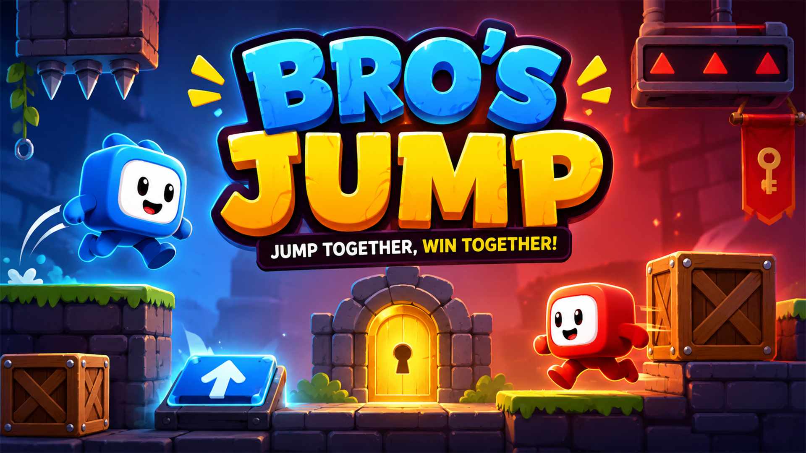
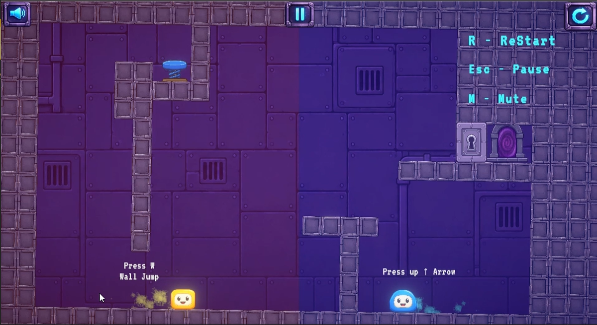
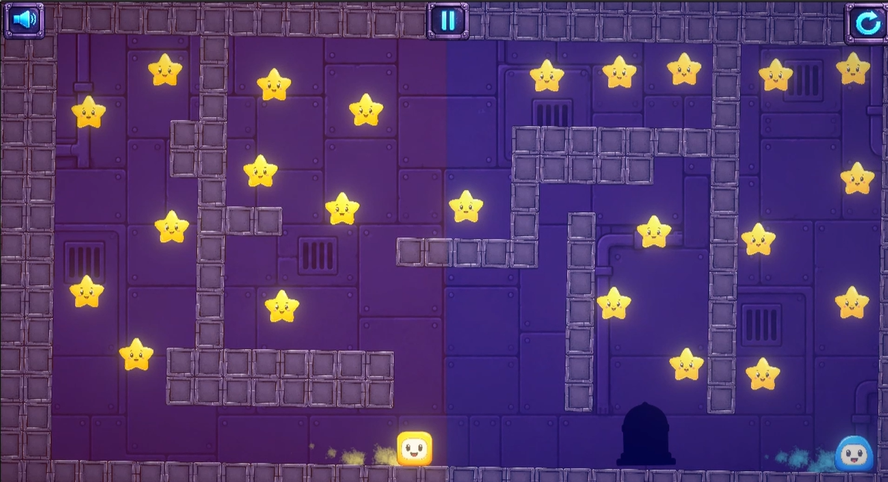

# 🎮 Bro's Jump

A Unity 6 2D cooperative puzzle-platformer built with C#, featuring unique player mechanics, interactive gameplay systems, and modular architecture.

---
## 🎯 Skills Demonstrated

- Gameplay Programming
- Event-Driven Architecture
- Unity Physics 2D
- Player Controllers
- Trigger Systems
- Reusable C# Design
- Object Interaction
---
## 📽️ Gameplay

🎮 **Play the game on itch.io**

https://abikarthick.itch.io/bros-jump

🎥 **Watch the development showcase on LinkedIn**

[<LINKEDIN_POST>](https://www.linkedin.com/posts/abikarthick_unity-unity3d-gamedevelopment-activity-7477653165648179200-wv3g?utm_source=share&utm_medium=member_desktop&rcm=ACoAAFSOB30BmmB1CU-K0qKbTzBatWHrXxYbp5U)



---

## 📸 Screenshots





---

## 🎯 About the Project

Bro's Jump is a cooperative-style 2D puzzle-platformer where two characters with different movement abilities work together to overcome obstacles and complete each level.

This project was developed to practice gameplay programming, reusable architecture, player interaction systems, and level mechanics in Unity.

---

# ✨ Features

* 🟦 Two unique playable characters
* 🚪 Interactive doors and trigger systems
* 📦 Pushable box mechanics
* 🎯 Portal interactions
* ✨ Particle effects
* 🔊 Audio management
* 🎮 Responsive movement and controls
* 📱 Mobile-friendly input support

---

# 💻 Technologies Used

* Unity 6
* C#
* Unity Physics 2D
* Unity Animation
* Unity Events
* Unity UI

---

# 📂 Repository Structure

```text
Bros-Jump-Unity/
│
├── README.md
├── LICENSE
│
├── Images/
│   ├── cover.png
│   ├── gameplay.gif
│   ├── screenshot1.png
│   └── screenshot2.png
│
├── Scripts/
│   ├── BluePlayer.cs
│   ├── RedPlayer.cs
│   ├── PlayerBase.cs
│   ├── ArrowPlatformTrigger.cs
│   └── DoorTrigger.cs
```

---

# 📜 Shared Gameplay Scripts

This repository includes selected gameplay scripts demonstrating:

* Player movement
* Character abilities
* Trigger systems
* Door interactions
* Event-driven gameplay

The complete Unity project is intentionally not included because it contains original game assets, scenes, prefabs, animations, and project files.

---

# 🎮 Controls

## Blue Player

* **Move:** Automatic
* **Jump:** ↑ Arrow

## Red Player

* **Move:** Automatic
* **Jump:** W

---

# 🚀 Play Online

🎮 https://abikarthick.itch.io/bros-jump

---

# 🤝 Connect With Me

* 💼 **LinkedIn:** www.linkedin.com/in/abikarthick

* 💻 **GitHub:** https://github.com/ABIKARTHICKGDEV

---

⭐ If you enjoyed the project, feel free to leave feedback or connect with me on LinkedIn!
